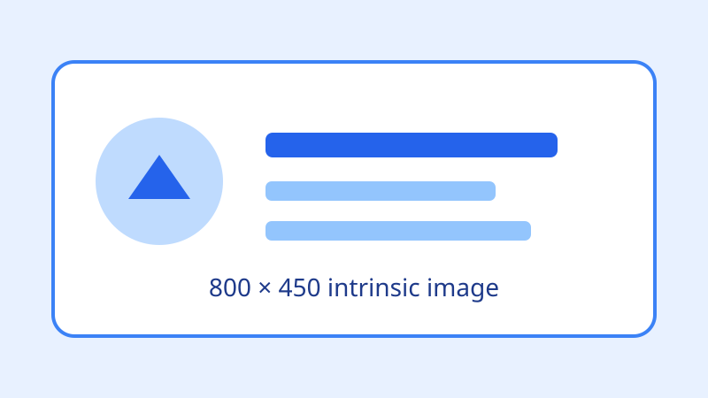

# KP065：图片地址与固有尺寸

> 所属章节：06 · 图片、音视频和嵌入
>
> 本知识点目标：理解 `img[src]` 如何定位资源、图片固有尺寸是什么，以及 `width` / `height` 如何帮助浏览器提前建立稳定布局。

## 目录

- [学习目标](#学习目标)
- [理论讲解](#理论讲解)
  - [1. src 是图片资源地址](#1-src-是图片资源地址)
  - [2. 图片固有尺寸](#2-图片固有尺寸)
  - [3. width、height 与布局稳定](#3-widthheight-与布局稳定)
- [动手编码：从 0 到 1](#动手编码从-0-到-1)
- [运行案例](#运行案例)
- [效果验证](#效果验证)
- [本节核心代码与实验辅助代码](#本节核心代码与实验辅助代码)

## 学习目标

完成本节后，你应该能够：

1. 使用 `src` 指向本地或网络图片资源。
2. 区分资源本身的固有尺寸与最终渲染尺寸。
3. 使用 `naturalWidth` / `naturalHeight` 观察浏览器得到的图片固有尺寸。
4. 理解 HTML `width` / `height` 属性为什么不仅是“把图片变大或变小”。
5. 用 CSS 做响应式缩放，同时保留 HTML 尺寸信息帮助浏览器提前建立宽高比。

## 理论讲解

### 1. `src` 是图片资源地址

最基本的图片写法：

```html

```

`src` 可以是：

- 文档相对 URL；
- 根相对 URL；
- 完整绝对 URL；
- 在某些场景下也可以是 `data:` 等 URL。

浏览器读取 HTML 后，会解析 `src`，发起资源请求，然后解码图片。

本节使用本地 `hero.svg`，这样案例不依赖外网。

### 2. 图片固有尺寸

图片资源本身通常带有尺寸信息。例如本节的 SVG：

```xml
<svg width="800" height="450" viewBox="0 0 800 450">
```

浏览器加载后可以通过：

```js
image.naturalWidth
image.naturalHeight
```

观察图片的固有尺寸。

注意三个容易混淆的概念：

- **固有尺寸**：资源自身提供的尺寸信息；
- **HTML 宽高属性**：`` 提供的尺寸提示；
- **最终渲染尺寸**：CSS 布局后用户真正看到的 `clientWidth` / `clientHeight`。

它们不一定相同。

### 3. `width`、`height` 与布局稳定

推荐为已知尺寸的图片写上：

```html

```

现代浏览器可以根据 `width` 和 `height` 提前推导宽高比。

这意味着即使图片还没有完成下载，浏览器也能预留接近正确比例的空间，降低图片加载完成后页面突然跳动的风险。

之后仍然可以通过 CSS 响应式缩放：

```css
img {
  max-width: 100%;
  height: auto;
}
```

所以：

> HTML `width` / `height` 不等于“禁止响应式”。它们可以提供重要的尺寸与宽高比信息，CSS 仍然负责最终布局。

## 动手编码：从 0 到 1

本节最终源码：[`index.html`](./index.html)

图片资源：[`hero.svg`](./hero.svg)

### 第 1 步：创建最小页面

```html
<!doctype html>
<html lang="zh-CN">
<head>
  <meta charset="UTF-8">
  <meta name="viewport" content="width=device-width, initial-scale=1">
  <title>KP065 - 图片地址与固有尺寸</title>
</head>
<body>
  <h1>图片地址与固有尺寸</h1>
</body>
</html>
```

**目标**：先得到独立可运行的 HTML 页面。

**运行后观察**：只有标题，没有图片请求。

### 第 2 步：使用 src 加载图片

```html

```

**为什么这样写**：`src` 是图片资源定位入口。

**运行后观察**：浏览器开始加载当前目录下的 `hero.svg`。

### 第 3 步：补充 width 和 height

```html

```

**为什么这样写**：资源尺寸已知，应把 800×450 的比例信息交给浏览器。

**运行后观察**：DOM 中能看到 `width="800" height="450"`。

### 第 4 步：让图片响应式缩放

```css
#hero {
  max-width: 100%;
  height: auto;
  display: block;
}
```

**为什么这样写**：HTML 保留尺寸信息，CSS 决定窄屏下的最终渲染宽度。

**运行后观察**：缩窄窗口时图片不会溢出页面。

### 第 5 步：打印固有尺寸、HTML 属性和渲染尺寸

```html
<pre id="result"></pre>
<script>
  const image = document.querySelector('#hero');

  function renderInfo() {
    document.querySelector('#result').textContent = [
      `src：${image.getAttribute('src')}`,
      `natural：${image.naturalWidth} × ${image.naturalHeight}`,
      `HTML 属性：${image.getAttribute('width')} × ${image.getAttribute('height')}`,
      `渲染尺寸：${image.clientWidth} × ${image.clientHeight}`
    ].join('\n');
  }

  image.addEventListener('load', renderInfo);
  window.addEventListener('resize', renderInfo);
</script>
```

**为什么这样写**：`getAttribute('width')` / `getAttribute('height')` 明确读取 HTML 内容属性，`clientWidth` / `clientHeight` 明确读取最终布局后的渲染尺寸，避免把两个层面混在一起。

**运行后观察**：窗口缩小时，`clientWidth` 会变化，而 HTML 属性值和图片资源的固有尺寸保持稳定。

## 运行案例

推荐使用 HTTP Server：

```bash
python3 -m http.server 8000
```

然后访问对应 `index.html`。

也可以直接双击打开，但 Network 面板观察资源请求时 HTTP Server 更清晰。

## 效果验证

1. Network 中能看到 `hero.svg` 请求。
2. 页面显示图片，不依赖外网。
3. `naturalWidth / naturalHeight` 显示资源固有尺寸。
4. `getAttribute('width') / getAttribute('height')` 显示 HTML 中声明的尺寸属性。
5. 缩窄浏览器后，`clientWidth / clientHeight` 变化，但 HTML 属性和宽高比信息保持稳定。
6. 删除 `width` / `height` 再刷新并使用慢速网络，可以对比浏览器在资源完成前可利用的布局信息差异。

## 本节核心代码与实验辅助代码

### 本节核心代码

```html

```

### 实验辅助代码

- `hero.svg`：为了让案例完全本地可运行的教学图片资源；
- CSS：用于展示响应式缩放；
- JavaScript：只负责输出 `naturalWidth`、HTML 内容属性尺寸和 `clientWidth` 渲染尺寸，不属于 `img[src]` 核心语法。
