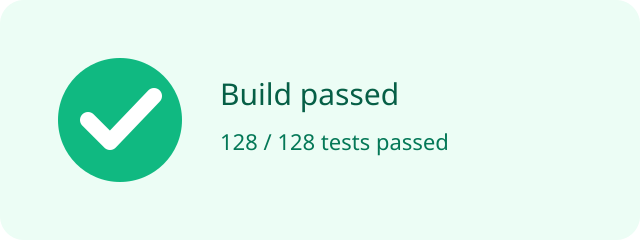

# KP066：图片替代文本 `alt`

> 所属章节：06 · 图片、音视频和嵌入
>
> 本知识点目标：正确区分信息图片、装饰图片与缺失 `alt`，理解替代文本是在图片不可见或由辅助技术访问时传递“图片用途与信息”的文本替代。

## 目录

- [学习目标](#学习目标)
- [理论讲解](#理论讲解)
  - [1. 信息图片需要有意义的 alt](#1-信息图片需要有意义的-alt)
  - [2. 装饰图片使用空 alt](#2-装饰图片使用空-alt)
  - [3. 空 alt 与缺少 alt 不一样](#3-空-alt-与缺少-alt-不一样)
- [动手编码：从 0 到 1](#动手编码从-0-到-1)
- [运行案例](#运行案例)
- [效果验证](#效果验证)
- [本节核心代码与实验辅助代码](#本节核心代码与实验辅助代码)

## 学习目标

完成本节后，你应该能够：

1. 为承载信息的图片编写简洁、有上下文的 `alt`。
2. 为纯装饰图片明确写 `alt=""`。
3. 理解“空字符串”和“根本没有 alt 属性”的区别。
4. 避免把文件名、无意义的“图片”二字当成替代文本。
5. 根据图片在当前上下文中的用途决定替代文本，而不是只看图片长什么样。

## 理论讲解

### 1. 信息图片需要有意义的 `alt`

如果图片表达正文中不可缺少的信息，需要提供文本替代：

```html

```

好的 `alt` 应回答：

> 如果用户看不到这张图，为了完成当前任务，需要知道什么？

不推荐：

```html
alt="图片"
alt="status.svg"
alt="一张蓝色的图片"
```

如果颜色、形状不是当前任务重点，就不必机械描述。

### 2. 装饰图片使用空 `alt`

纯装饰图形不提供新增信息时：

```html

```

空 `alt` 表示：这张图片存在，但不需要作为内容被单独传达。

典型场景：

- 标题旁边的装饰星星；
- 已经由相邻文本完整表达的信息图标；
- 纯视觉分隔元素。

如果能用 CSS 背景更自然地表达纯装饰，也可以不用 ``。

### 3. 空 `alt` 与缺少 `alt` 不一样

这两个写法语义意图不同：

```html

```

```html

```

前者明确声明“这是装饰图片”。

后者只是没有提供替代文本。辅助技术在不同情况下可能尝试使用文件名、URL 或其它信息，体验不可控。

所以不要把“忘记写 alt”当成“装饰图片”。

另外，`alt` 不是悬浮提示。需要可见说明时，应使用正文、`figcaption` 等结构，而不是依赖 `title`。

## 动手编码：从 0 到 1

最终源码：[`index.html`](./index.html)

资源：[`status.svg`](./status.svg)、[`sparkle.svg`](./sparkle.svg)

### 第 1 步：加入一张信息图片

```html

```

**目标**：让图片传达的核心状态有文本替代。

**运行后观察**：视觉上显示状态卡片；DOM 中存在有意义的 `alt`。

### 第 2 步：加入装饰图片

```html
<h2>
  今日推荐
  
</h2>
```

**为什么为空**：标题文字“今日推荐”已经完整表达内容，星星只是装饰。

### 第 3 步：加入缺少 alt 的反例

```html

```

这段代码只用于教学对照，**不是推荐写法**。

**运行后观察**：视觉上与装饰图可能一模一样，但 DOM 中根本没有 `alt` 属性。

### 第 4 步：用脚本检查三种状态

```js
const images = document.querySelectorAll('img');

for (const image of images) {
  console.log({
    hasAlt: image.hasAttribute('alt'),
    alt: image.getAttribute('alt')
  });
}
```

**目标**：明确 `alt=""` 与没有 `alt` 的差异是可以从 DOM 直接观察的。

## 运行案例

推荐通过静态 HTTP Server 打开 `index.html`。

测试时可以：

- 在 DevTools Elements 中修改 `src` 为错误路径，观察图片加载失败时替代文本；
- 使用浏览器 Accessibility 面板检查图片的可访问名称；
- 使用读屏软件进一步验证信息图片与装饰图片的差异。

## 效果验证

1. 信息图片具有描述当前信息的 `alt`。
2. 装饰图片明确使用 `alt=""`。
3. 教学反例缺少 `alt`，页面脚本会将它标记出来。
4. 把信息图片 `src` 改错时，替代文本仍能表达核心状态。
5. 替代文本没有重复“图片 / 图像”这类无意义前缀。
6. 你能说明：同一张图片放在不同上下文中，`alt` 可能不同。

## 本节核心代码与实验辅助代码

### 本节核心代码

信息图片：

```html

```

装饰图片：

```html

```

### 实验辅助代码

- SVG 文件：本地教学资源；
- 缺少 `alt` 的图片：故意保留的反例；
- JavaScript：仅用于输出 `hasAttribute('alt')` 与属性值，帮助观察，不属于 `alt` 核心语法。
