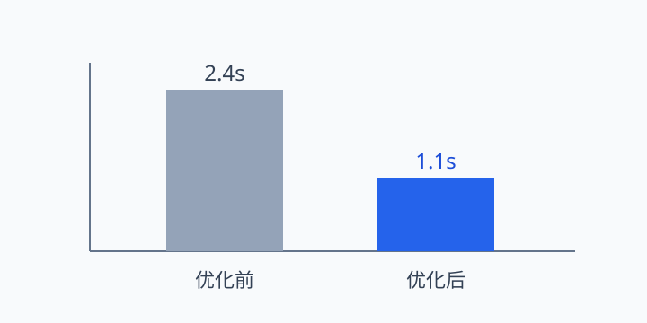

# KP067：`figure` 独立内容单元

> 所属章节：06 · 图片、音视频和嵌入
>
> 本知识点目标：理解 `figure` 表达的是“可作为一个整体引用、移动或分发的独立内容单元”，而不是“所有图片外面都必须套 figure”。

## 目录

- [学习目标](#学习目标)
- [理论讲解](#理论讲解)
  - [1. figure 的核心语义](#1-figure-的核心语义)
  - [2. figure 不只包图片](#2-figure-不只包图片)
  - [3. 什么时候不需要 figure](#3-什么时候不需要-figure)
- [动手编码：从 0 到 1](#动手编码从-0-到-1)
- [运行案例](#运行案例)
- [效果验证](#效果验证)
- [本节核心代码与实验辅助代码](#本节核心代码与实验辅助代码)

## 学习目标

完成本节后，你应该能够：

1. 判断一段图片、代码、图表是否适合作为 `<figure>`。
2. 理解 `figure` 的重点是“独立单元”，不是某种默认样式。
3. 理解 `figure` 可以包含图片、代码、表格或其它 flow content。
4. 区分正文内普通图片与可单独引用的图示。
5. 理解 `figcaption` 是可选的说明结构，本节只作为辅助出现，下一节单独深入。

## 理论讲解

### 1. `figure` 的核心语义

`<figure>` 适合表示：

> 正文引用的一块独立内容，即使把它移动到旁边、章节末尾或单独展示，正文仍然能够成立。

例如一张性能趋势图：

```html
<figure>
  
  <figcaption>图 1：性能优化前后的加载时间</figcaption>
</figure>
```

正文可以写：

```html
<p>如图 1 所示，优化后的首屏加载时间明显下降。</p>
```

这时图表整体是一个可引用的独立单元。

### 2. `figure` 不只包图片

`figure` 可以包：

- 图片；
- 图表；
- 代码片段；
- 公式；
- 引用示例；
- 其它能作为独立整体理解的内容。

例如：

```html
<figure>
  <pre><code>const answer = 42;</code></pre>
  <figcaption>示例 1：最小 JavaScript 赋值语句</figcaption>
</figure>
```

所以不要把 `figure` 理解成“图片专用容器”。

### 3. 什么时候不需要 `figure`

不是所有图片都需要 `figure`。

例如品牌 Logo：

```html
<header>
  
</header>
```

它是页面 UI 的组成部分，不一定是正文中可独立引用的“图示”。

判断问题可以简化为：

1. 这块内容是否可以作为一个整体独立理解？
2. 正文是否可能以“图 1 / 示例 2 / 下图”这类方式引用它？
3. 把它移动到正文附近其它位置，正文逻辑是否仍然成立？

如果答案大多是“是”，`figure` 往往合适。

## 动手编码：从 0 到 1

最终源码：[`index.html`](./index.html)

资源：[`chart.svg`](./chart.svg)

### 第 1 步：写正文结论

```html
<p>本轮优化后，页面首屏加载时间下降了约一半。</p>
```

### 第 2 步：加入可独立引用的图表

```html
<figure id="performance-figure">
  
</figure>
```

**为什么使用 figure**：图表本身是一个独立数据单元，正文可以引用它。

### 第 3 步：加入图注

```html
<figcaption>图 1：性能优化前后的首屏加载时间</figcaption>
```

本节只先建立完整结构；`figcaption` 的具体语义边界在 KP068 继续讲。

### 第 4 步：加入非 figure 对照

```html
<div class="brand">
  <span>课程平台</span>
</div>
```

页面普通 UI 容器不因为“视觉上也是一个卡片”就应该改成 `figure`。

### 第 5 步：观察 figure 的直接子元素

```js
const figure = document.querySelector('#performance-figure');
const children = [...figure.children].map(element => element.tagName);
```

**运行后观察**：输出 `IMG -> FIGCAPTION`，说明 DOM 把整块内容组织成单一 figure。

## 运行案例

通过浏览器打开 `index.html`。

建议同时打开：

- Elements：检查 `figure > img + figcaption`；
- Accessibility：观察图示结构和图片替代文本；
- 页面正文：确认把 `figure` 看作一个整体时内容仍然自然。

## 效果验证

1. 图表由 `<figure>` 包裹。
2. 图片拥有自己的 `alt`，不是只依赖图注。
3. 页面正文能够自然引用“图 1”。
4. 普通 UI 内容没有被滥用为 `figure`。
5. 删除 CSS 后，figure 语义结构仍然存在。
6. 你能解释：`figure` 的判断标准是内容独立性，而不是“有没有图片”。

## 本节核心代码与实验辅助代码

### 本节核心代码

```html
<figure>
  
  <figcaption>...</figcaption>
</figure>
```

### 实验辅助代码

- `chart.svg`：本地可运行的图表示例；
- CSS：只负责尺寸与可读性；
- JavaScript：只打印 `figure` 直接子元素，用于观察 DOM，不是 `figure` 核心功能。
