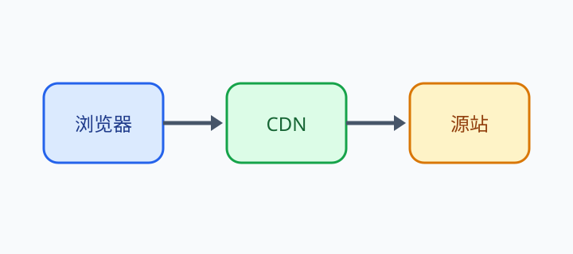

# KP068：`figcaption` 图注

> 所属章节：06 · 图片、音视频和嵌入
>
> 本知识点目标：理解 `figcaption` 是 `figure` 的可见说明文字，掌握它与 `alt` 的职责区别，以及前置 / 后置位置规则。

## 目录

- [学习目标](#学习目标)
- [理论讲解](#理论讲解)
  - [1. figcaption 表达什么](#1-figcaption-表达什么)
  - [2. figcaption 与 alt 不重复](#2-figcaption-与-alt-不重复)
  - [3. figcaption 的位置](#3-figcaption-的位置)
- [动手编码：从 0 到 1](#动手编码从-0-到-1)
- [运行案例](#运行案例)
- [效果验证](#效果验证)
- [本节核心代码与实验辅助代码](#本节核心代码与实验辅助代码)

## 学习目标

完成本节后，你应该能够：

1. 使用 `<figcaption>` 给 `<figure>` 提供可见说明。
2. 理解 `figcaption` 不是图片 `alt` 的替代品。
3. 根据上下文编写“图片内容”和“图注说明”两个不同层次的文本。
4. 正确把 `figcaption` 放在 `figure` 的第一个或最后一个子元素位置。
5. 通过 DOM 检查确认图注属于哪个 `figure`。

## 理论讲解

### 1. `figcaption` 表达什么

`figcaption` 是 `figure` 的标题、说明或注释。

例如：

```html
<figure>
  
  <figcaption>图 2：静态资源请求链路</figcaption>
</figure>
```

用户视觉上能直接看到图注。

它适合表达：

- 图编号；
- 数据来源；
- 图表解释；
- 截图时间；
- 代码示例说明；
- 作品标题或附加上下文。

### 2. `figcaption` 与 `alt` 不重复

这两个字段服务于不同问题。

`alt` 回答：

> 如果图片本身不可见，图片传达了什么必要信息？

`figcaption` 回答：

> 这个 figure 对正文来说是什么、叫什么、来自哪里或需要补充什么上下文？

例如：

```html

<figcaption>图 2：静态资源请求链路，简化示意</figcaption>
```

这比把两处都写成“静态资源请求链路图”更有价值。

### 3. `figcaption` 的位置

一个 `figure` 最多有一个 `figcaption`。

它应位于 `figure` 的第一个或最后一个子元素位置。

后置图注：

```html
<figure>
  
  <figcaption>图注</figcaption>
</figure>
```

前置图注：

```html
<figure>
  <figcaption>图注</figcaption>
  
</figure>
```

两种都合法。实际项目中选择一种稳定约定即可。

## 动手编码：从 0 到 1

最终源码：[`index.html`](./index.html)

资源：[`diagram.svg`](./diagram.svg)

### 第 1 步：创建 figure 与图片

```html
<figure id="after-caption">
  
</figure>
```

### 第 2 步：添加后置 figcaption

```html
<figcaption>图 1：静态资源请求链路，教学简化示意</figcaption>
```

**运行后观察**：图注显示在图片下方，并属于同一个 figure。

### 第 3 步：再创建一个前置图注示例

```html
<figure id="before-caption">
  <figcaption>图 2：同一图示，使用前置图注</figcaption>
  
</figure>
```

### 第 4 步：打印图注位置

```js
for (const figure of document.querySelectorAll('figure')) {
  const caption = figure.querySelector(':scope > figcaption');
  const position = caption === figure.firstElementChild ? 'first' : 'last';
  console.log(figure.id, position);
}
```

**目标**：直接从 DOM 验证前置 / 后置位置。

## 运行案例

推荐通过 HTTP Server 访问 `index.html`，并在 DevTools Elements 中展开两个 `figure`。

## 效果验证

1. 页面存在两个 figure。
2. 第一个 `figcaption` 是最后一个子元素。
3. 第二个 `figcaption` 是第一个子元素。
4. 图片 `alt` 描述图片信息，图注提供编号和上下文，没有机械重复。
5. 删除 CSS 后，图注仍然保持与 figure 的结构关系。
6. 你能解释为什么可见图注不能代替图片的替代文本。

## 本节核心代码与实验辅助代码

### 本节核心代码

```html
<figure>
  
  <figcaption>...</figcaption>
</figure>
```

### 实验辅助代码

- `diagram.svg`：本地教学图；
- CSS：只负责排版；
- JavaScript：只检查 `figcaption` 是 figure 的第一个还是最后一个子元素。
