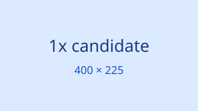
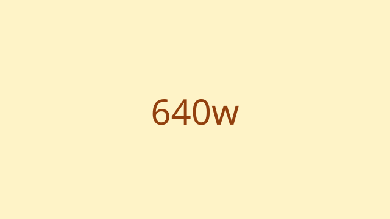

# KP069：`srcset` 响应式图片候选

> 所属章节：06 · 图片、音视频和嵌入
>
> 本知识点目标：掌握 `srcset` 的像素密度描述符 `x`、宽度描述符 `w`，并通过 `currentSrc` 观察浏览器实际选择的图片候选。

## 目录

- [学习目标](#学习目标)
- [理论讲解](#理论讲解)
  - [1. 像素密度描述符](#1-像素密度描述符)
  - [2. 宽度描述符](#2-宽度描述符)
  - [3. 浏览器如何选择候选](#3-浏览器如何选择候选)
- [动手编码：从 0 到 1](#动手编码从-0-到-1)
- [运行案例](#运行案例)
- [效果验证](#效果验证)
- [本节核心代码与实验辅助代码](#本节核心代码与实验辅助代码)

## 学习目标

完成本节后，你应该能够：

1. 使用 `1x` / `2x` 提供不同像素密度候选。
2. 使用 `320w` / `640w` / `960w` 提供不同固有宽度候选。
3. 知道同一个 `srcset` 不应混用 `x` 与 `w` 描述符。
4. 理解 `src` 仍然是重要的回退资源。
5. 使用 `img.currentSrc` 观察浏览器最终采用的候选资源。
6. 理解候选选择由 DPR、viewport、slot 大小、缓存和浏览器策略共同影响。

## 理论讲解

### 1. 像素密度描述符

如果图片在布局中的显示尺寸比较固定，但需要为高 DPR 屏幕提供更高分辨率资源，可以写：

```html

```

`1x` / `2x` 描述的是资源适合的设备像素密度倍数。

常见理解：

- DPR ≈ 1：更可能选择 1x；
- DPR ≈ 2：更可能选择 2x。

但浏览器仍可能受缓存、网络和资源策略影响。

### 2. 宽度描述符

另一种方式是告诉浏览器每个文件的**固有宽度**：

```html

```

这里的 `320w` 表示：

> 这个候选资源的固有宽度是 320 CSS 像素。

`w` 不是“强制显示成 320px”。

最终显示多宽仍由 CSS 布局决定。

### 3. 浏览器如何选择候选

对于 `w` 描述符，浏览器需要估计图片在页面中将占据多大的 **slot**。

如果没有显式 `sizes`，浏览器通常会按 `100vw` 这一默认 slot 假设来参与候选计算。

简化理解可以写成：

```text
期望资源宽度 ≈ slot CSS 宽度 × devicePixelRatio
```

然后浏览器从可用候选中选择合适资源。

真正算法还有浏览器策略、缓存、网络条件等因素，所以不要写死“某个窗口宽度一定请求某一张”。

最可靠的实验方式是看：

```js
image.currentSrc
```

## 动手编码：从 0 到 1

最终源码：[`index.html`](./index.html)

候选资源均为本地 SVG。

### 第 1 步：创建密度候选

```html

```

### 第 2 步：创建宽度候选

```html

```

**注意**：当前例子故意不写 `sizes`，目的是把“宽度候选”与下一节的 slot 描述拆开学习。

### 第 3 步：加入 CSS

```css
#density-image {
  width: 400px;
  max-width: 100%;
  height: auto;
}

#width-image {
  width: min(100%, 640px);
  height: auto;
}
```

### 第 4 步：输出 currentSrc

```js
function printCurrentSrc(image) {
  return `${image.id} -> ${image.currentSrc}`;
}
```

**运行后观察**：页面会显示当前 DPR、viewport 和两个图片的 `currentSrc`。

## 运行案例

推荐：

1. 通过 HTTP Server 打开页面；
2. 打开 Network 面板并勾选 Disable cache；
3. 使用设备模拟切换 DPR；
4. 刷新页面；
5. 对照页面输出的 `currentSrc`。

注意：浏览器已经加载过更高分辨率资源后，缩小窗口不一定会主动降级重新下载低分辨率文件。这属于正常优化行为。

## 效果验证

1. 密度图片的 `srcset` 使用 `1x / 2x`。
2. 宽度图片的 `srcset` 使用 `320w / 640w / 960w`。
3. 两套描述符没有混写在同一个 `srcset` 中。
4. 页面能输出 `devicePixelRatio`。
5. 页面能输出每张图片的 `currentSrc`。
6. 在不同 DPR / viewport 下刷新，候选选择可能发生变化。
7. 你能解释：`w` 描述资源固有宽度，不是 CSS 显示宽度。

## 本节核心代码与实验辅助代码

### 本节核心代码

```html

```

以及：

```html

```

### 实验辅助代码

- 多个 SVG：为了让候选文件名和图内文字都能直观看出选中了哪张；
- JavaScript：只读取 `currentSrc`、DPR 和 viewport；
- CSS：只负责固定实验 slot 的视觉宽度。
