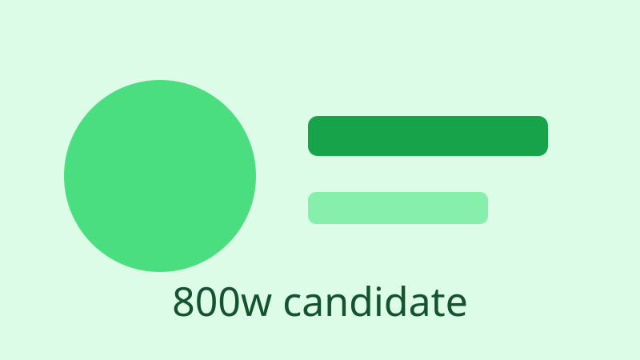

# KP070：`sizes` 描述图片插槽宽度

> 所属章节：06 · 图片、音视频和嵌入
>
> 本知识点目标：理解 `sizes` 描述的是响应式布局中的图片 slot 宽度，并掌握它与 `w` 描述符 `srcset` 的配合方式。

## 目录

- [学习目标](#学习目标)
- [理论讲解](#理论讲解)
  - [1. sizes 描述的是 slot](#1-sizes-描述的是-slot)
  - [2. 媒体条件按顺序匹配](#2-媒体条件按顺序匹配)
  - [3. sizes 与 w 描述符配合](#3-sizes-与-w-描述符配合)
- [动手编码：从 0 到 1](#动手编码从-0-到-1)
- [运行案例](#运行案例)
- [效果验证](#效果验证)
- [本节核心代码与实验辅助代码](#本节核心代码与实验辅助代码)

## 学习目标

完成本节后，你应该能够：

1. 解释 `sizes` 不是候选图片文件大小，也不是图片真实字节大小。
2. 根据响应式 CSS 布局写出对应 slot 宽度描述。
3. 理解 `sizes` 从左到右匹配第一个成立的媒体条件。
4. 保留最后一个无条件值作为 fallback slot。
5. 将 `sizes` 与 `320w / 640w / 960w` 这类宽度候选配合。
6. 用 `currentSrc`、`clientWidth`、DPR 验证候选选择。

## 理论讲解

### 1. `sizes` 描述的是 slot

假设页面设计规定：

- 小屏：图片接近整个视口宽度；
- 中屏：图片占视口一半；
- 大屏：图片固定 480px。

CSS 可能写成：

```css
.media {
  width: calc(100vw - 40px);
}

@media (min-width: 601px) {
  .media { width: 50vw; }
}

@media (min-width: 1001px) {
  .media { width: 480px; }
}
```

那么图片的 `sizes` 应尽量描述同一套布局事实：

```html
sizes="
  (max-width: 600px) calc(100vw - 40px),
  (max-width: 1000px) 50vw,
  480px
"
```

`sizes` 不是让 CSS 生效。

它只是提前告诉浏览器：

> 在真正完成布局之前，这张图片大概会占多宽的 slot。

### 2. 媒体条件按顺序匹配

浏览器从左到右寻找第一个匹配项：

```text
(max-width: 600px) calc(100vw - 40px)
(max-width: 1000px) 50vw
480px
```

如果 viewport = 500px：

- 第一条匹配；
- slot ≈ `100vw - 40px`。

如果 viewport = 800px：

- 第一条不匹配；
- 第二条匹配；
- slot ≈ `50vw`。

如果 viewport = 1400px：

- 前两条不匹配；
- 使用最后的 `480px`。

最后一个无条件长度非常重要，它是 fallback。

### 3. `sizes` 与 `w` 描述符配合

完整结构：

```html

```

浏览器会结合：

- `sizes` 推测 slot；
- `devicePixelRatio`；
- `srcset` 中的资源宽度；
- 网络、缓存和内部策略；

选择一个候选。

可以用下面的近似模型理解：

```text
理想资源宽度 ≈ slot × DPR
```

但不要把它当成绝对下载公式。

## 动手编码：从 0 到 1

最终源码：[`index.html`](./index.html)

### 第 1 步：先写与设计一致的 CSS

```css
.media {
  width: calc(100vw - 40px);
  max-width: 100%;
}

@media (min-width: 601px) {
  .media { width: 50vw; }
}

@media (min-width: 1001px) {
  .media { width: 480px; }
}
```

### 第 2 步：加入 w 候选

```html

```

### 第 3 步：补上 sizes

```html
sizes="(max-width: 600px) calc(100vw - 40px), (max-width: 1000px) 50vw, 480px"
```

**为什么这样写**：它与 CSS 的三个布局区间保持一致。

### 第 4 步：输出当前 slot 和 currentSrc

```js
const image = document.querySelector('#responsive-image');

console.log({
  viewport: innerWidth,
  dpr: devicePixelRatio,
  renderedWidth: image.clientWidth,
  currentSrc: image.currentSrc
});
```

### 第 5 步：判断当前命中了哪条 sizes 规则

```js
function currentRule() {
  if (matchMedia('(max-width: 600px)').matches) return 'calc(100vw - 40px)';
  if (matchMedia('(max-width: 1000px)').matches) return '50vw';
  return '480px';
}
```

这样能把 CSS 实际宽度、声明 slot 和浏览器选择的候选放在同一页比较。

## 运行案例

建议使用 HTTP Server + DevTools：

1. Disable cache；
2. 切换不同 viewport；
3. 可切换设备 DPR；
4. 每次大幅改变测试条件后刷新页面；
5. 观察 `currentSrc` 和 Network。

浏览器可能保留已经加载的较大候选，不一定在缩小时重新下载更小文件，因此实验时刷新更容易观察。

## 效果验证

1. CSS 和 `sizes` 的三个宽度区间一致。
2. `srcset` 使用 `w` 描述符。
3. 页面能显示当前匹配的 slot 规则。
4. 页面能显示图片实际 `clientWidth`。
5. 页面能显示 `currentSrc`。
6. 在 500px、800px、1200px 三种 viewport 下，slot 规则分别变化。
7. 你能解释：`sizes` 是浏览器的资源选择提示，不是 CSS 布局替代品。

## 本节核心代码与实验辅助代码

### 本节核心代码

```html

```

### 实验辅助代码

- 三个 SVG：让候选结果可肉眼识别；
- CSS：模拟真实响应式 slot；
- JavaScript：输出媒体规则、渲染宽度与 `currentSrc`，用于验证 `sizes`。
