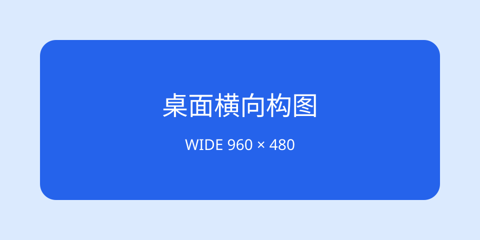

# KP071：`picture` 艺术方向

> 所属章节：06 · 图片、音视频和嵌入
>
> 本知识点目标：理解 `<picture>` 如何根据媒体条件切换不同构图，以及 `<source>` 的匹配顺序和 `` 回退职责。

## 目录

- [学习目标](#学习目标)
- [理论讲解](#理论讲解)
  - [1. picture 解决什么问题](#1-picture-解决什么问题)
  - [2. source 的匹配顺序](#2-source-的匹配顺序)
  - [3. img 是必需回退](#3-img-是必需回退)
- [动手编码：从 0 到 1](#动手编码从-0-到-1)
- [运行案例](#运行案例)
- [效果验证](#效果验证)
- [本节核心代码与实验辅助代码](#本节核心代码与实验辅助代码)

## 学习目标

完成本节后，你应该能够：

1. 区分“同一构图换清晰度”和“艺术方向切换”。
2. 使用 `<picture>` + `<source media>` 为不同视口提供不同构图。
3. 理解浏览器按源码顺序检查 `<source>`。
4. 理解 `` 不是可选占位，而是图片语义与最终回退入口。
5. 使用 `currentSrc` 验证最终命中的资源。

## 理论讲解

### 1. picture 解决什么问题

`srcset + sizes` 更适合同一内容、同一构图的不同尺寸候选；`<picture>` 常用于 **art direction（艺术方向）**：

- 桌面端展示横向大图；
- 手机端改成更紧凑的竖向/方形裁切；
- 不同场景使用不同构图，而不只是同一图片更清晰。

```html
<picture>
  <source media="(max-width: 640px)" srcset="./narrow.svg">
  
</picture>
```

### 2. source 的匹配顺序

浏览器会按 `<source>` 在源码中的顺序检查条件。对于 `<picture>`：

1. 当前 `<source>` 的 `media` 是否匹配；
2. `type`（如果存在）是否是浏览器可用类型；
3. `srcset` 中是否有可选择候选；
4. 命中后不再继续找后面的 `<source>`。

因此更具体的条件通常放前面。

### 3. img 是必需回退

`<picture>` 最后必须有 ``：

```html
<picture>
  <source ...>
  
</picture>
```

`` 负责：

- 图片元素本身；
- `alt` 替代文本；
- `width` / `height` 等图片属性；
- 没有 `<source>` 命中时的回退资源。

不要把 `<picture>` 理解成可以单独显示图片的标签。

## 动手编码：从 0 到 1

最终源码：[`index.html`](./index.html)

资源：[`wide.svg`](./wide.svg)、[`narrow.svg`](./narrow.svg)

### 第 1 步：先写普通图片

```html

```

**目标**：建立正常图片回退。

**观察**：无论窗口多宽，始终使用横向版本。

### 第 2 步：增加 picture 和移动端 source

```html
<picture>
  <source media="(max-width: 640px)" srcset="./narrow.svg">
  
</picture>
```

**目标**：窄屏使用另一套构图。

**为什么这样写**：移动端版本不是简单缩小，而是不同画布比例。

**观察**：在 DevTools 切换到 640px 以下时资源应切换。

### 第 3 步：输出匹配结果

```js
const hero = document.querySelector('#hero');
const mobile = matchMedia('(max-width: 640px)');

function render() {
  result.textContent = `media 匹配：${mobile.matches}\ncurrentSrc：${hero.currentSrc}`;
}
```

**目标**：不要只凭肉眼猜浏览器用了哪张图。

**观察**：切换视口后 `currentSrc` 文件名变化。

## 运行案例

推荐启动静态服务器：

```bash
python3 -m http.server 8000
```

打开本知识点的 `index.html`，再使用 DevTools Responsive Mode 调整宽度。

## 效果验证

1. 宽屏时 `currentSrc` 指向 `wide.svg`。
2. 640px 以下时 `currentSrc` 指向 `narrow.svg`。
3. DOM 中 `` 始终存在。
4. 删除 `<source>` 后页面仍由 `` 正常显示。
5. 两张 SVG 构图比例明显不同，证明这是艺术方向而非单纯清晰度切换。

## 本节核心代码与实验辅助代码

### 本节核心代码

```html
<picture>
  <source media="(max-width: 640px)" srcset="./narrow.svg">
  
</picture>
```

### 实验辅助代码

- `wide.svg` / `narrow.svg`：本地教学图片；
- CSS：控制展示尺寸；
- JavaScript：输出 `matchMedia()` 与 `currentSrc`，不是 `<picture>` 核心语法。
