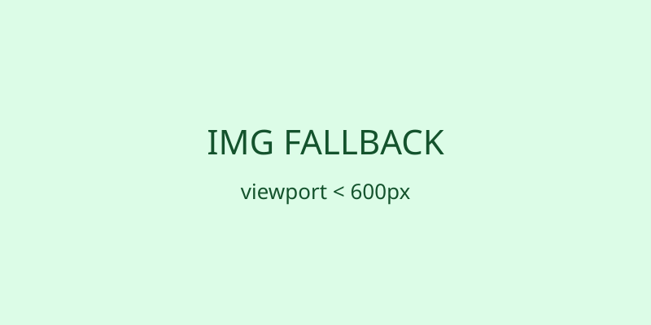

# KP072：`source` 的 `type`、`media` 与格式回退

> 所属章节：06 · 图片、音视频和嵌入
>
> 本知识点目标：理解 `<source>` 如何用 `type` 提示资源格式、用 `media` 限定条件，以及浏览器如何继续寻找后续候选和 `` 回退。

## 目录

- [学习目标](#学习目标)
- [理论讲解](#理论讲解)
- [动手编码：从 0 到 1](#动手编码从-0-到-1)
- [运行案例](#运行案例)
- [效果验证](#效果验证)
- [本节核心代码与实验辅助代码](#本节核心代码与实验辅助代码)

## 学习目标

1. 理解 `type` 是资源类型提示，不是强制转换。
2. 理解 `media` 决定当前 `<source>` 是否参与选择。
3. 知道浏览器可跳过声明为不支持类型的候选。
4. 能为现代格式准备后续格式或 `` 回退。
5. 用 `currentSrc` 验证真实选择结果。

## 理论讲解

### 1. type 是格式提示

```html
<source srcset="./modern.avif" type="image/avif">
```

浏览器如果知道自己不支持该 MIME 类型，可以直接跳过，而不必先下载再失败。

本案例故意放一个教学用“不支持类型”在最前面：

```html
<source srcset="./ignored.svg" type="image/x-teaching-unsupported">
```

它用于观察“类型不满足时继续找后续候选”。

### 2. media 是条件

```html
<source
  media="(min-width: 600px)"
  srcset="./preferred.svg"
  type="image/svg+xml"
>
```

只有媒体条件匹配时，该候选才会参与选择。

### 3. 格式回退依赖顺序

典型生产写法：

```html
<picture>
  <source srcset="hero.avif" type="image/avif">
  <source srcset="hero.webp" type="image/webp">
  
</picture>
```

浏览器从前往后选择第一个满足条件的 `<source>`，都不合适时使用 ``。

## 动手编码：从 0 到 1

最终源码：[`index.html`](./index.html)

### 第 1 步：准备 img 回退

```html

```

**观察**：只有回退资源时始终显示 `fallback.svg`。

### 第 2 步：增加不支持类型候选

```html
<source srcset="./ignored.svg" type="image/x-teaching-unsupported">
```

**目标**：验证浏览器不会因为它排在第一就一定选择它。

### 第 3 步：增加带 media 的 SVG 候选

```html
<source
  media="(min-width: 600px)"
  srcset="./preferred.svg"
  type="image/svg+xml"
>
```

**观察**：宽度达到 600px 时，应选择 `preferred.svg`；更窄时回到 `` 的 `fallback.svg`。

### 第 4 步：输出 source 配置与 currentSrc

JavaScript 读取每个 `<source>` 的 `type`、`media` 和 `srcset`，同时打印 `img.currentSrc`。

**目标**：把“声明了什么”和“实际命中了什么”分开看。

## 运行案例

```bash
python3 -m http.server 8000
```

在 600px 上下切换视口宽度，并查看 Network 和页面输出。

## 效果验证

1. `ignored.svg` 因教学用不支持 MIME 类型而被跳过。
2. 宽屏时 `currentSrc` 指向 `preferred.svg`。
3. 窄屏时 `currentSrc` 指向 `fallback.svg`。
4. 删除第二个 `<source>` 后仍有 `` 回退。
5. Network 面板可辅助确认实际请求资源。

## 本节核心代码与实验辅助代码

### 本节核心代码

```html
<picture>
  <source srcset="..." type="..." media="...">
  
</picture>
```

### 实验辅助代码

本地 SVG 和 JavaScript 只用于观察候选匹配，不改变 `<source>` 的核心规则。
